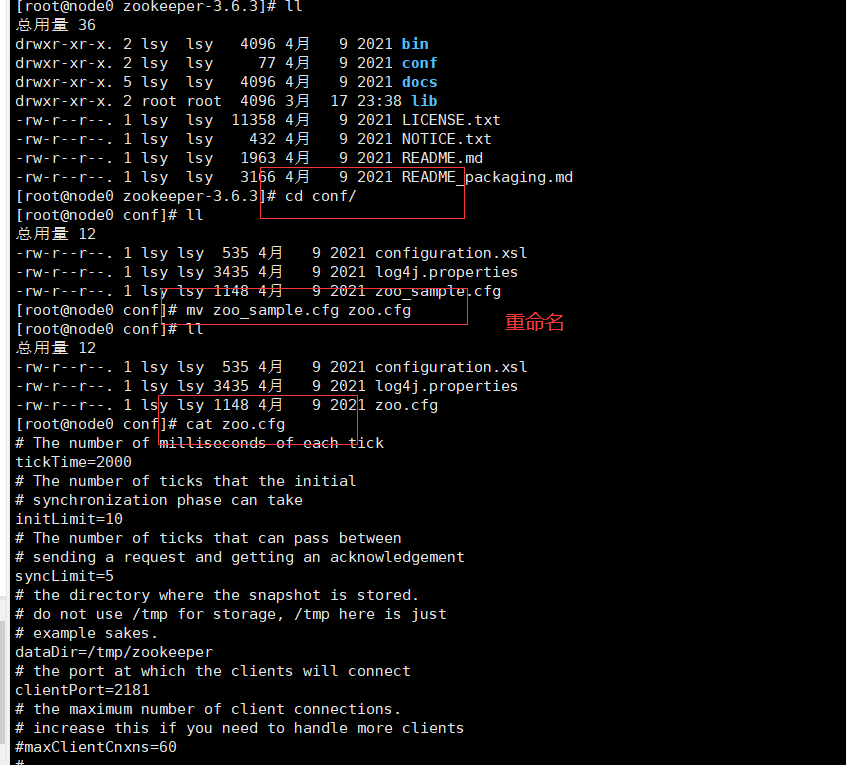
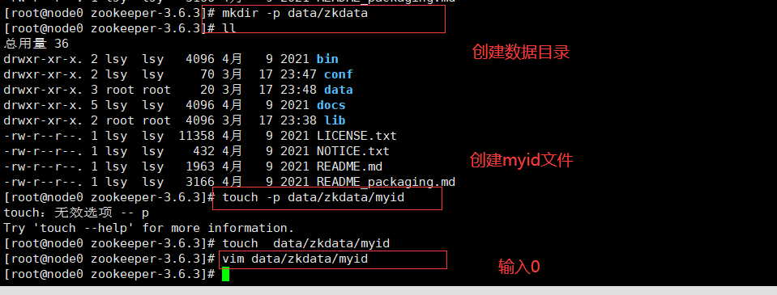
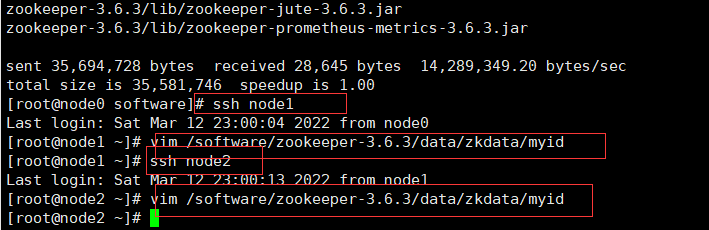
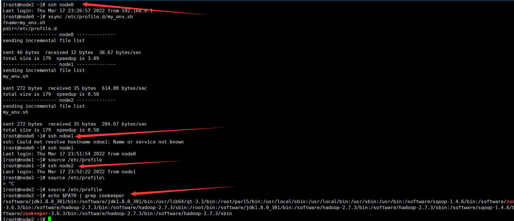
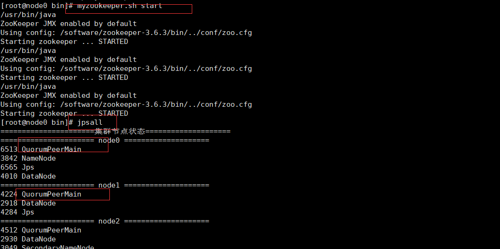

### zookeeper

1.修改配置文件



2.添加主机信息

```
server.0={hostname}:2888:3888
server.1={hostname}:2888:3888
server.2={hostname}:2888:3888
```

3.配置环境变量

```
source /etc/profile
echo $PATH | grep zookeeper
```

4.创建数据目录

5.分发并修改从节点的myid

```
xsync zookeeper路径
```



6.分发环境变量，并更新环境变量



7.编写启动脚本

```
#/bin/sh
#for start or stop zookeeper
 
a=$1
 
if [[ $a = "start" ]];then
        for host in  node0 node1 node2
        do
        ssh $host "zkServer.sh start"
        done
elif [[ $a == "stop" ]];then
        for host in  node0 node1 node2
        do
        ssh $host "zkServer.sh stop"
        #ssh $host "ps -ef | grep zookeeper |egrep -v grep | awk -F " " '{print $2}' | xargs kill -9"
        done
 
elif [[ $a == "status" ]];then
        for host in  node0 node1 node2
        do
        ssh $host "zkServer.sh status"
        done
 
else
        echo "你输入的参数不正确，请重新输入!"
fi
```

```
赋权限 + 复制到/bin
chmod u+x myzookeeper.sh
```

8.安装完成



