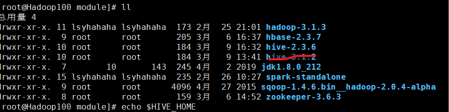
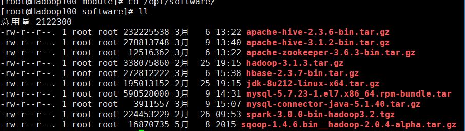
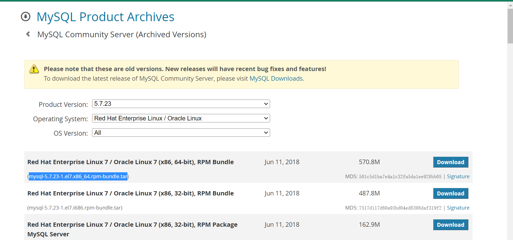
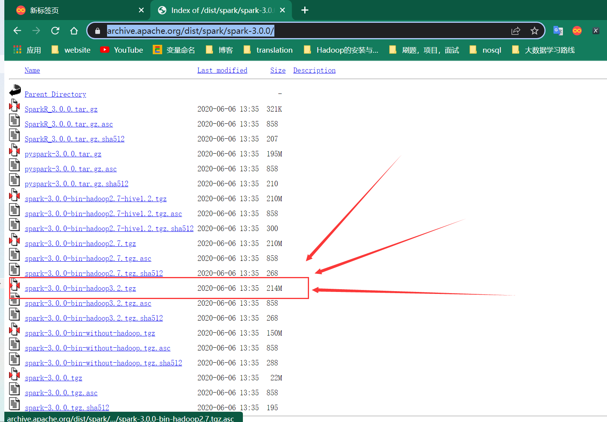

版本信息：





查看状态集群：

```
hadoop dfsadmin -report
```

安装包下载连接：

[zookeeper-3.6.3](https://dlcdn.apache.org/zookeeper/zookeeper-3.6.3/apache-zookeeper-3.6.3-bin.tar.gz)

```
https://dlcdn.apache.org/zookeeper/zookeeper-3.6.3/apache-zookeeper-3.6.3-bin.tar.gz
```

[hive-2.3.9](https://mirrors.tuna.tsinghua.edu.cn/apache/hive/hive-2.3.9/)(2.3.6的找不到了，官网寄了)

```
https://mirrors.tuna.tsinghua.edu.cn/apache/hive/hive-2.3.9/
```

[sqoop](http://archive.apache.org/dist/sqoop/)

```
http://archive.apache.org/dist/sqoop/1.4.6/sqoop-1.4.6.bin__hadoop-2.0.4-alpha.tar.gz
```

[mysql](https://downloads.mysql.com/archives/community/)

```
下载链接：https://downloads.mysql.com/archives/get/p/23/file/mysql-5.7.23-1.el7.x86_64.rpm-bundle.tar
```



[spark-3.0.0-bin-hadoop3.2.tgz](https://archive.apache.org/dist/spark/spark-3.0.0/)

```
https://archive.apache.org/dist/spark/spark-3.0.0/spark-3.0.0-bin-hadoop3.2.tgz
```

